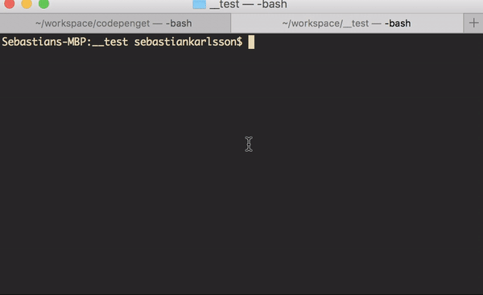
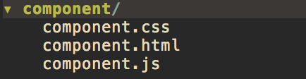

# Codepenget
> Download components from codepen

## Installation
> How to install:

    python setup.py install

## Usage
> How to use:

    codepenget <url_to_pen>

> 

> This will download the css, js and html and put it inside a `component`
> directory.

> 
